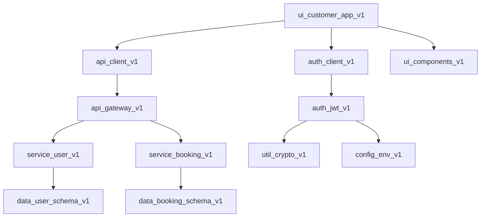

# Context Expansion & Sub-Module Methodology

## Context Expansion Strategies

### 1. Modular Documentation Architecture
**Principle**: Break complex systems into interconnected, manageable documentation modules that reference each other.

**Implementation**:
- Each major feature area gets its own detailed specification document
- Documents include clear references to related modules and dependencies
- Cross-references use consistent linking patterns: `[Module Name](module_id)`
- Regular consolidation sessions to merge related concepts

### 2. Iterative Refinement Process
**Principle**: Continuously evolve project understanding through structured feedback loops.

**Process**:
1. **Weekly Reviews**: Update CLAUDE.md preferences based on new insights
2. **Bi-weekly Consolidation**: Merge related artifacts and eliminate redundancy
3. **Monthly Architecture Reviews**: Assess overall system design and adjust course
4. **Quarterly Strategic Reviews**: Evaluate business goals and technical alignment

### 3. External Knowledge Integration
**Principle**: Leverage external resources to expand beyond knowledge limitations.

**Methods**:
- **Research Integration**: Use web search for latest industry standards and best practices
- **Competitive Analysis**: Study existing solutions and identify improvement opportunities
- **Technology Updates**: Regular searches for new tools and framework updates
- **Regulatory Research**: Stay current with licensing and compliance requirements

### 4. Progressive Disclosure
**Principle**: Reveal complexity gradually as project understanding deepens.

**Approach**:
- Start with high-level conceptual models
- Add implementation details in subsequent iterations
- Create multiple levels of documentation (executive, technical, implementation)
- Use abstraction layers to manage complexity

## Sub-Module Tracking System

### Module Registry
**Central tracking document that maps all project modules and their relationships.**

#### Module Categories & Naming
```
Format: [category]_[function]_[version]

Categories:
- core: Essential system functionality
- auth: Authentication and authorization
- data: Database schemas and data management
- api: Backend services and routes
- ui: User interface components
- service: Business logic and external integrations
- util: Utility functions and helpers
- config: Configuration and setup
- test: Testing and quality assurance
- docs: Documentation and specifications
```

### Module Manifest Template
```yaml
module_id: auth_jwt_v1
category: auth
version: 1.0.0
status: development | testing | production | deprecated
dependencies:
  - util_crypto_v1
  - config_env_v1
provides:
  - JWT token generation
  - Token validation
  - User session management
integrates_with:
  - api_user_routes_v1
  - ui_login_component_v1
file_locations:
  - backend/src/auth/jwt.js
  - backend/tests/auth/jwt.test.js
documentation: auth_specifications_v1.md
last_updated: 2025-05-31
next_review: 2025-06-07
```

### Dependency Visualization


### Module Integration Points
**Track how modules combine to create larger systems:**

#### Customer Mobile App Assembly
```javascript
const CustomerApp = {
  base: 'ui_shell_v1',
  components: [
    'ui_booking_form_v1',
    'ui_contractor_list_v1', 
    'ui_job_status_v1',
    'ui_payment_flow_v1'
  ],
  services: [
    'api_client_v1',
    'auth_client_v1',
    'geolocation_service_v1'
  ],
  config: 'config_mobile_v1'
}
```

#### Backend API Assembly
```javascript
const BackendAPI = {
  gateway: 'api_gateway_v1',
  routes: [
    'api_user_routes_v1',
    'api_booking_routes_v1',
    'api_payment_routes_v1'
  ],
  middleware: [
    'auth_middleware_v1',
    'validation_middleware_v1',
    'logging_middleware_v1'
  ],
  services: [
    'service_user_mgmt_v1',
    'service_booking_v1',
    'service_payment_v1'
  ]
}
```

## Overcoming Artificial Limitations

### 1. Memory and Context Management
**Challenge**: Limited conversation context for complex projects.

**Solutions**:
- **State Persistence**: Use artifacts as external memory storage
- **Session Summaries**: Create regular project state summaries
- **Modular Recall**: Each artifact contains context for its domain
- **Cross-Reference Maps**: Maintain relationship diagrams between modules

### 2. Knowledge Cutoff Limitations
**Challenge**: Need for current information beyond training data.

**Solutions**:
- **Automated Research**: Use web search for technology updates
- **Competitive Intelligence**: Regular searches for industry developments
- **Regulatory Updates**: Monitor changing compliance requirements
- **Technology Trends**: Track emerging tools and frameworks

### 3. Complexity Management
**Challenge**: Large projects exceed cognitive load limits.

**Solutions**:
- **Hierarchical Decomposition**: Break problems into manageable sub-problems
- **Interface Standardization**: Use consistent patterns across modules
- **Progressive Enhancement**: Build core functionality first, add features incrementally
- **Abstraction Layers**: Hide complexity behind clean interfaces

### 4. Quality Assurance at Scale
**Challenge**: Maintaining quality across many interconnected modules.

**Solutions**:
- **Automated Testing**: Each module includes test specifications
- **Code Review Checklists**: Standardized quality gates
- **Integration Testing**: Verify module combinations work together
- **Performance Monitoring**: Track system health across all components

## Implementation Workflow

### Daily Operations
1. **Morning Review**: Check TODO.md for current priorities
2. **Development Work**: Focus on current module with clear scope
3. **Documentation Updates**: Update relevant artifacts after changes
4. **End-of-Day Summary**: Update progress and identify blockers

### Weekly Cycles
1. **Monday Planning**: Review weekly goals and adjust priorities
2. **Wednesday Integration**: Test module combinations and integration points
3. **Friday Review**: Update CLAUDE.md preferences and consolidate learnings
4. **Documentation Sync**: Ensure all artifacts reflect current state

### Quality Gates
Before considering any module "complete":
- [ ] Documentation updated with current implementation
- [ ] Dependencies clearly identified and tested
- [ ] Integration points verified with dependent modules
- [ ] Test coverage meets requirements (>80%)
- [ ] Performance benchmarks met
- [ ] Security review completed

## Continuous Improvement Process

### Feedback Loops
1. **Technical Feedback**: Monitor system performance and user experience
2. **Business Feedback**: Track contractor and customer satisfaction
3. **Development Feedback**: Assess development velocity and quality
4. **Strategic Feedback**: Evaluate alignment with business goals

### Adaptation Strategies
- **Pivot Protocols**: Clear criteria for when to change direction
- **Version Control**: Maintain history of decisions and rationale
- **Rollback Procedures**: Safe ways to revert problematic changes
- **Knowledge Transfer**: Document lessons learned for future reference

### Success Metrics for Methodology
- **Development Velocity**: Features delivered per sprint
- **Quality Metrics**: Bug rates, performance benchmarks
- **Team Efficiency**: Time from concept to production
- **Knowledge Retention**: Successful onboarding of new team members

---
*Created: May 31, 2025*
*Version: 1.0*
*Next Evolution: Based on first month of implementation experience*