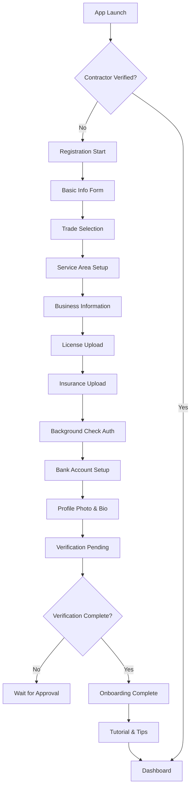
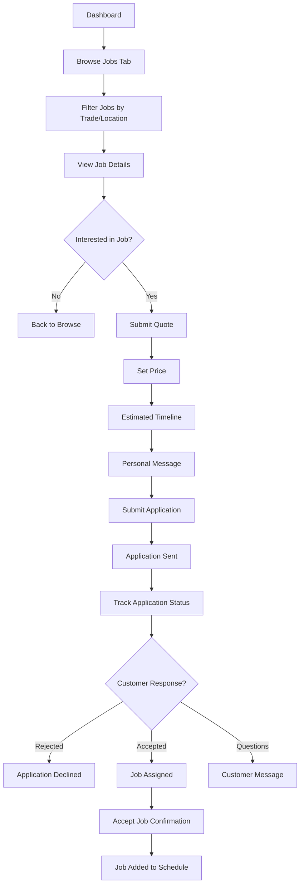
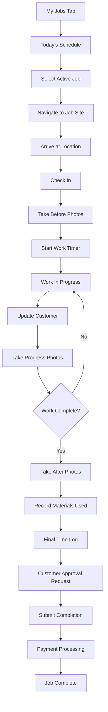

# Contractor Mobile App Structure - contractor_mobile_app_v1

**Module ID**: contractor_mobile_app_v1  
**Version**: 1.0.0  
**Dependencies**: ui_design_system_v1, auth_strategy_v1, api_specification_v1  
**Provides**: Complete contractor-facing mobile application for iOS and Android  
**Integration Points**: Backend API, GPS tracking, camera integration, payment processing  
**Last Updated**: 2025-05-31

## App Architecture Overview

### Technology Stack
- **Framework**: React Native with TypeScript (shared with customer app)
- **State Management**: Redux Toolkit with RTK Query
- **Navigation**: React Navigation 6
- **UI Components**: Custom design system with contractor-specific theming
- **Maps & GPS**: Google Maps SDK with real-time tracking
- **Camera**: React Native Camera for job documentation
- **Background Tasks**: Background job for location tracking
- **Calendar Integration**: React Native Calendar Events
- **File Upload**: React Native Document Picker

### App Structure

```
ContractorApp/
├── src/
│   ├── components/           # Reusable UI components
│   ├── screens/             # Screen components
│   ├── navigation/          # Navigation configuration
│   ├── store/              # Redux store and slices
│   ├── services/           # API services and utilities
│   ├── hooks/              # Custom React hooks
│   ├── utils/              # Helper functions
│   └── types/              # TypeScript type definitions
├── assets/                 # Images, fonts, icons
├── ios/                   # iOS-specific code
├── android/               # Android-specific code
└── __tests__/             # Test files
```

## User Flow Mapping

### 1. Contractor Onboarding Flow


### 2. Job Discovery & Application Flow


### 3. Job Execution Flow


## Screen Wireframes

### Core Screens Structure

#### 1. Authentication & Onboarding
- **Welcome Screen**: Contractor-focused messaging
- **Registration Flow**: Multi-step verification process
- **Document Upload**: License, insurance, certifications
- **Background Check**: Integration with verification services
- **Bank Setup**: Stripe Connect onboarding

#### 2. Main Navigation (Tab Bar)
- **Dashboard**: Earnings, stats, quick actions
- **Jobs**: Available jobs, applications, schedule
- **My Work**: Active jobs, job history
- **Profile**: Settings, documents, availability

### Detailed Screen Specifications

#### Dashboard Screen Layout
```
┌─────────────────────────────────────┐
│ [≡] Good morning, Mike    [🔔] [🟢] │
├─────────────────────────────────────┤
│ Today's Status: Available ✅        │
│ ┌─────────────────────────────────┐ │
│ │ 📊 This Week's Stats            │ │
│ │ 💰 $1,247 earned | 🔧 8 jobs    │ │
│ │ ⭐ 4.9 rating | ⚡ 95% complete │ │
│ └─────────────────────────────────┘ │
│                                     │
│ 🗓️ Today's Schedule                 │
│ ┌─────────────────────────────────┐ │
│ │ 10:00 AM - Kitchen Faucet       │ │
│ │ 📍 123 Oak St. (15 min away)    │ │
│ │ 👤 Sarah Johnson                │ │
│ │ [Navigate] [Contact] [Details]  │ │
│ └─────────────────────────────────┘ │
│                                     │
│ 🔔 New Opportunities (3)           │
│ ┌─────────────────────────────────┐ │
│ │ 🔧 Bathroom Sink Repair         │ │
│ │ 💰 $85-120 | 📍 2.3 mi away    │ │
│ │ ⏰ Tomorrow morning             │ │
│ │ [View Details] [Quick Apply]    │ │
│ └─────────────────────────────────┘ │
└─────────────────────────────────────┘
```

#### Job Details Screen
```
┌─────────────────────────────────────┐
│ [←] Kitchen Faucet Repair           │
├─────────────────────────────────────┤
│ 📍 123 Oak Street                   │
│ ⏰ Tomorrow, 10:00 AM - 12:00 PM    │
│ 💰 Customer Budget: $80 - $150     │
│                                     │
│ 👤 Customer: Sarah Johnson          │
│ ⭐ 4.8 rating | 12 jobs completed   │
│                                     │
│ 📝 Job Description:                 │
│ Kitchen faucet has been leaking     │
│ from the base for 3 days. Water    │
│ pools around the sink area...      │
│                                     │
│ 📷 Customer Photos:                 │
│ ┌───┐ ┌───┐ ┌───┐                  │
│ │🖼️ │ │🖼️ │ │🖼️ │                  │
│ └───┘ └───┘ └───┘                  │
│                                     │
│ 📍 Distance: 2.3 miles (8 min)     │
│ 🏠 Property Type: Single Family     │
│ 🔑 Access: Homeowner present       │
│                                     │
│      [Submit Quote] [Pass]          │
└─────────────────────────────────────┘
```

#### Submit Quote Screen
```
┌─────────────────────────────────────┐
│ [←] Submit Your Quote               │
├─────────────────────────────────────┤
│ Job: Kitchen Faucet Repair          │
│ Customer Budget: $80 - $150         │
│                                     │
│ Your Quote                          │
│ ┌─────────────────────────────────┐ │
│ │ $ 120                           │ │
│ └─────────────────────────────────┘ │
│                                     │
│ Estimated Time                      │
│ ┌─────────────────────────────────┐ │
│ │ 2 hours                         │ │
│ └─────────────────────────────────┘ │
│                                     │
│ Earliest Available                  │
│ ┌─────────────────────────────────┐ │
│ │ Tomorrow, 10:00 AM              │ │
│ └─────────────────────────────────┘ │
│                                     │
│ Message to Customer (Optional)      │
│ ┌─────────────────────────────────┐ │
│ │ Hi Sarah! I can fix your faucet │ │
│ │ tomorrow morning. I have 8 years│ │
│ │ experience and carry all parts. │ │
│ └─────────────────────────────────┘ │
│                                     │
│              [Submit Quote]         │
└─────────────────────────────────────┘
```

#### Active Job Screen
```
┌─────────────────────────────────────┐
│ [←] Kitchen Faucet Repair    [Chat] │
├─────────────────────────────────────┤
│ ⏰ Started: 10:15 AM | ⏱️ 1h 23m    │
│ 📍 123 Oak Street                   │
│ 👤 Sarah Johnson | 📞 (555) 123-4567│
│                                     │
│ Job Progress:                       │
│ ✅ Arrived on time                  │
│ ✅ Diagnosed issue                  │
│ ✅ Took before photos               │
│ 🔄 Installing new faucet            │
│ ⏳ Testing & cleanup                │
│                                     │
│ 📷 Work Photos:                     │
│ ┌───┐ ┌───┐ ┌───┐ ┌─+─┐             │
│ │🖼️ │ │🖼️ │ │🖼️ │ │Add│             │
│ └───┘ └───┘ └───┘ └───┘             │
│                                     │
│ 🛠️ Materials Used:                  │
│ ┌─────────────────────────────────┐ │
│ │ Moen faucet model #1234 - $85  │ │
│ │ [Add Material]                  │ │
│ └─────────────────────────────────┘ │
│                                     │
│    [Update Customer] [Complete Job] │
└─────────────────────────────────────┘
```

#### Earnings Dashboard
```
┌─────────────────────────────────────┐
│      Earnings & Analytics           │
├─────────────────────────────────────┤
│ 💰 This Week: $1,247.00            │
│ 📊 This Month: $4,891.00           │
│                                     │
│ Weekly Breakdown:                   │
│ ████████████████████ 100% ($1,247) │
│ Mon ████ Tue ██████ Wed ████ Thu ██ │
│                                     │
│ 🎯 Performance Metrics:             │
│ ┌─────────────────────────────────┐ │
│ │ ⭐ Average Rating: 4.9/5        │ │
│ │ ⚡ Response Time: 12 minutes    │ │
│ │ ✅ Completion Rate: 98%         │ │
│ │ 🔄 Repeat Customers: 34%        │ │
│ └─────────────────────────────────┘ │
│                                     │
│ 💳 Payout Schedule: Weekly          │
│ Next payout: Friday, $1,247.00     │
│                                     │
│ 📈 [View Detailed Analytics]        │
│ 💰 [Payout Settings]               │
└─────────────────────────────────────┘
```

## Component Specifications

### Contractor-Specific Components

#### JobOpportunityCard Component
```typescript
interface JobOpportunityCardProps {
  job: JobOpportunity;
  distance: number;
  estimatedDriveTime: number;
  customerRating: number;
  urgency: 'low' | 'medium' | 'high' | 'emergency';
  onApply: () => void;
  onViewDetails: () => void;
}

// Visual indicators:
// - Emergency jobs: Red border, urgent badge
// - High-paying jobs: Gold accent
// - Repeat customers: Loyalty badge
```

#### WorkTimer Component
```typescript
interface WorkTimerProps {
  jobId: string;
  isActive: boolean;
  startTime?: Date;
  onStart: () => void;
  onPause: () => void;
  onStop: () => void;
}

// Features:
// - Background timer continuation
// - Break time tracking
// - Automatic overtime alerts
```

#### EarningsWidget Component
```typescript
interface EarningsWidgetProps {
  period: 'day' | 'week' | 'month' | 'year';
  totalEarnings: number;
  jobCount: number;
  averageJobValue: number;
  trend: 'up' | 'down' | 'stable';
}

// Visual elements:
// - Progress charts
// - Comparison with previous period
// - Goal tracking
```

### Navigation Structure

#### Tab Navigation (Contractor-specific)
```typescript
const ContractorTabNavigator = createBottomTabNavigator({
  Dashboard: {
    screen: DashboardScreen,
    options: {
      tabBarIcon: 'home',
      tabBarLabel: 'Dashboard'
    }
  },
  Jobs: {
    screen: JobsScreen,
    options: {
      tabBarIcon: 'briefcase',
      tabBarLabel: 'Find Work',
      tabBarBadge: newJobsCount // Show available jobs count
    }
  },
  MyWork: {
    screen: MyWorkScreen,
    options: {
      tabBarIcon: 'tool',
      tabBarLabel: 'My Work'
    }
  },
  Earnings: {
    screen: EarningsScreen,
    options: {
      tabBarIcon: 'dollar-sign',
      tabBarLabel: 'Earnings'
    }
  },
  Profile: {
    screen: ProfileScreen,
    options: {
      tabBarIcon: 'user',
      tabBarLabel: 'Profile'
    }
  }
});
```

## State Management

### Contractor-Specific Redux Store
```typescript
interface ContractorAppState {
  auth: AuthState;
  contractor: ContractorState;
  jobs: ContractorJobsState;
  schedule: ScheduleState;
  earnings: EarningsState;
  location: LocationState;
  app: AppState;
}

interface ContractorState {
  profile: ContractorProfile;
  availability: AvailabilitySettings;
  serviceAreas: ServiceArea[];
  verificationStatus: VerificationStatus;
  businessMetrics: BusinessMetrics;
}

interface ContractorJobsState {
  availableJobs: JobOpportunity[];
  applications: JobApplication[];
  activeJobs: ActiveJob[];
  completedJobs: CompletedJob[];
  currentJob: ActiveJob | null;
  filters: JobFilters;
}

interface ScheduleState {
  todaySchedule: ScheduledJob[];
  weekSchedule: ScheduledJob[];
  availability: WeeklyAvailability;
  breaks: Break[];
}
```

### Real-time Features
```typescript
// WebSocket connection for real-time updates
export const contractorWebSocket = {
  // New job notifications
  onNewJobAvailable: (job: JobOpportunity) => void,
  
  // Customer messages
  onCustomerMessage: (message: Message) => void,
  
  // Job status updates
  onJobStatusUpdate: (jobId: string, status: JobStatus) => void,
  
  // Emergency job alerts
  onEmergencyJob: (job: EmergencyJob) => void,
  
  // Payment notifications
  onPaymentReceived: (payment: Payment) => void,
};
```

## Contractor-Specific Features

### GPS Tracking & Navigation
- **Route Optimization**: AI-powered route planning for multiple jobs
- **Real-time Location**: Share location with customers during service
- **Mileage Tracking**: Automatic business mileage logging
- **Arrival Notifications**: Auto-notify customers when approaching
- **Service Area Management**: Dynamic service radius based on demand

### Camera & Documentation
- **Before/After Photos**: Mandatory documentation workflow
- **Progress Updates**: Time-stamped photo uploads
- **Problem Documentation**: Issue identification with annotations
- **Material Receipts**: Expense tracking with OCR
- **Video Calls**: Remote assistance for complex problems

### Business Management Tools
- **Expense Tracking**: Material and tool cost management
- **Tax Documentation**: 1099 form generation and export
- **Insurance Integration**: Claims and verification management
- **License Tracking**: Renewal reminders and document storage
- **Customer History**: Complete interaction timeline

### Emergency Response System
- **Emergency Jobs**: High-priority job alerts with premium pay
- **24/7 Availability**: Opt-in emergency service hours
- **Rapid Response**: Sub-30-minute response time commitments
- **Emergency Kit**: Pre-positioned tool and material recommendations
- **Backup Network**: Partner contractor coverage

## Contractor Onboarding Enhancements

### Verification Process
```typescript
interface VerificationFlow {
  personalInfo: PersonalInfoStep;
  businessInfo: BusinessInfoStep;
  licensing: LicensingStep;
  insurance: InsuranceStep;
  backgroundCheck: BackgroundCheckStep;
  bankingSetup: BankingStep;
  skillAssessment: SkillAssessmentStep;
  finalReview: FinalReviewStep;
}

// Each step includes:
// - Document upload with OCR validation
// - Real-time verification status
// - Integration with third-party services
// - Error handling and retry mechanisms
```

### Training & Certification
- **Platform Training**: App usage and best practices
- **Customer Service**: Communication and professionalism
- **Safety Protocols**: Job site safety and insurance requirements
- **Quality Standards**: Photo documentation and work quality
- **Business Skills**: Pricing, time management, customer retention

## Performance Optimization

### Background Processing
- **Location Services**: Efficient GPS tracking with battery optimization
- **Photo Processing**: Background image compression and upload
- **Data Sync**: Offline-first architecture with background sync
- **Push Notifications**: Intelligent notification batching
- **Background Jobs**: Automatic status updates and reminders

### Battery & Resource Management
- **Smart GPS**: Adaptive location polling based on job status
- **Image Optimization**: Progressive JPEG with WebP fallback
- **Cache Management**: Intelligent cache invalidation
- **Network Optimization**: Request batching and retry logic
- **Memory Management**: Efficient image and data handling

## Security & Compliance

### Contractor-Specific Security
- **License Verification**: Real-time license status checking
- **Insurance Validation**: Continuous insurance coverage monitoring
- **Background Monitoring**: Ongoing background check updates
- **Location Privacy**: Secure location sharing with customers only
- **Financial Security**: PCI DSS compliance for payment processing

### Regulatory Compliance
- **State Licensing**: Multi-state license requirement tracking
- **Insurance Requirements**: State-specific insurance minimums
- **Tax Compliance**: 1099-K reporting and tax document generation
- **Labor Laws**: Hours tracking and break time compliance
- **Safety Standards**: OSHA compliance tracking and reporting

---

**Integration Points**:
- Customer app for real-time coordination
- Admin dashboard for contractor management
- Payment processing for automatic payouts
- Background check services for verification
- Mapping services for route optimization

**Next Phase**: Implementation of job matching algorithm and real-time tracking features  
**Testing Strategy**: Comprehensive testing including GPS accuracy, camera functionality, and offline capabilities