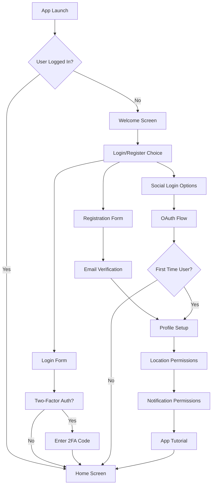
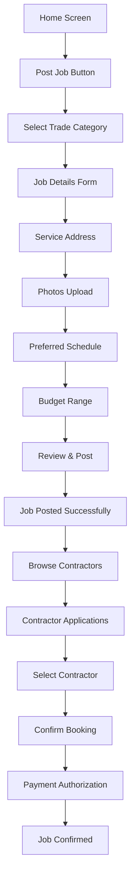
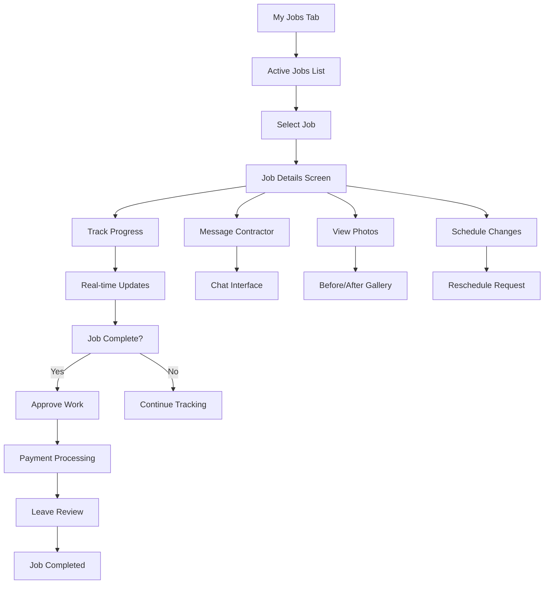

# Customer Mobile App Structure - customer_mobile_app_v1

**Module ID**: customer_mobile_app_v1  
**Version**: 1.0.0  
**Dependencies**: ui_design_system_v1, auth_strategy_v1, api_specification_v1  
**Provides**: Complete customer-facing mobile application for iOS and Android  
**Integration Points**: Backend API, push notifications, payment processing, maps integration  
**Last Updated**: 2025-05-31

## App Architecture Overview

### Technology Stack
- **Framework**: React Native with TypeScript
- **State Management**: Redux Toolkit with RTK Query
- **Navigation**: React Navigation 6
- **UI Components**: Custom design system + React Native Elements
- **Maps**: Google Maps SDK
- **Payments**: Stripe SDK
- **Push Notifications**: Firebase Cloud Messaging
- **Image Handling**: React Native Image Picker
- **Storage**: AsyncStorage + Keychain Services

### App Structure

```
CustomerApp/
├── src/
│   ├── components/           # Reusable UI components
│   ├── screens/             # Screen components
│   ├── navigation/          # Navigation configuration
│   ├── store/              # Redux store and slices
│   ├── services/           # API services and utilities
│   ├── hooks/              # Custom React hooks
│   ├── utils/              # Helper functions
│   └── types/              # TypeScript type definitions
├── assets/                 # Images, fonts, icons
├── ios/                   # iOS-specific code
├── android/               # Android-specific code
└── __tests__/             # Test files
```

## User Flow Mapping

### 1. Onboarding & Authentication Flow


### 2. Job Posting Flow


### 3. Job Management Flow


## Screen Wireframes

### Core Screens Structure

#### 1. Authentication Screens
- **Welcome Screen**: Brand introduction, login/register options
- **Registration Screen**: Multi-step form with validation
- **Login Screen**: Email/password with social login options
- **Verification Screen**: Email/SMS code verification
- **Profile Setup**: Basic info, address, preferences

#### 2. Main Navigation (Tab Bar)
- **Home**: Job posting, quick actions, recent activity
- **My Jobs**: Active and completed jobs management
- **Messages**: Conversations with contractors
- **Profile**: Settings, payment methods, preferences

#### 3. Job Management Screens
- **Post Job Screen**: Multi-step job creation flow
- **Contractor Browse**: Search and filter contractors
- **Job Details**: Comprehensive job view with actions
- **Chat Screen**: Real-time messaging with contractors
- **Payment Screen**: Secure payment processing

### Detailed Screen Specifications

#### Home Screen Layout
```
┌─────────────────────────────────────┐
│ [≡]  Welcome Back, John   [🔔] [👤] │
├─────────────────────────────────────┤
│                                     │
│  ┌─────────────────────────────────┐ │
│  │     🔧 Need a Repair?           │ │
│  │   [Post a Job] [Emergency]      │ │
│  └─────────────────────────────────┘ │
│                                     │
│  📍 Your Recent Jobs                │
│  ┌─────────────────────────────────┐ │
│  │ 🔧 Kitchen Faucet Repair        │ │
│  │ ⏰ Today, 2:00 PM               │ │
│  │ 👷 Mike Johnson - Plumber       │ │
│  │ ● In Progress    [View Details] │ │
│  └─────────────────────────────────┘ │
│                                     │
│  🎯 Recommended for You             │
│  ┌─────────────────────────────────┐ │
│  │ ❄️ HVAC Maintenance Special     │ │
│  │ 💰 $89 - Winter Prep Service   │ │
│  │ ⭐ 4.9★ | 15 min away          │ │
│  └─────────────────────────────────┘ │
└─────────────────────────────────────┘
```

#### Post Job Screen Flow
```
Step 1: Category Selection
┌─────────────────────────────────────┐
│ [←] What kind of work do you need?  │
├─────────────────────────────────────┤
│                                     │
│  ┌───────┐ ┌───────┐ ┌───────┐      │
│  │  🔧   │ │  ⚡   │ │  🔨   │      │
│  │Plumbing│ │Electric│ │Carpentry│   │
│  └───────┘ └───────┘ └───────┘      │
│                                     │
│  ┌───────┐ ┌───────┐ ┌───────┐      │
│  │  ❄️   │ │  🎨   │ │  🏠   │      │
│  │ HVAC  │ │ Paint │ │General│      │
│  └───────┘ └───────┘ └───────┘      │
└─────────────────────────────────────┘

Step 2: Job Details
┌─────────────────────────────────────┐
│ [←] Describe your plumbing job      │
├─────────────────────────────────────┤
│ Job Title                           │
│ ┌─────────────────────────────────┐ │
│ │ Kitchen faucet leaking          │ │
│ └─────────────────────────────────┘ │
│                                     │
│ Description                         │
│ ┌─────────────────────────────────┐ │
│ │ My kitchen faucet has been      │ │
│ │ dripping constantly. It seems   │ │
│ │ to be coming from the base...   │ │
│ └─────────────────────────────────┘ │
│                                     │
│ 📷 Add Photos (Optional)            │
│ ┌───┐ ┌───┐ ┌───┐                  │
│ │ + │ │   │ │   │                  │
│ └───┘ └───┘ └───┘                  │
│                                     │
│           [Continue]                │
└─────────────────────────────────────┘
```

#### My Jobs Screen
```
┌─────────────────────────────────────┐
│      My Jobs                   [+]  │
├─────────────────────────────────────┤
│ [Active] [Completed] [Cancelled]    │
├─────────────────────────────────────┤
│                                     │
│ ┌─────────────────────────────────┐ │
│ │ 🔧 Kitchen Faucet Repair  ● ON │ │
│ │ 👷 Mike Johnson              │ │
│ │ ⏰ Today, 2:00 PM - 4:00 PM  │ │
│ │ 💰 $120                      │ │
│ │ [Message] [Track] [Details]  │ │
│ └─────────────────────────────────┘ │
│                                     │
│ ┌─────────────────────────────────┐ │
│ │ ⚡ Outlet Installation    🟡 PENDING │
│ │ 👥 3 contractors applied     │ │
│ │ ⏰ Tomorrow, 10:00 AM       │ │
│ │ 💰 $85 - $150               │ │
│ │ [View Applications]          │ │
│ └─────────────────────────────────┘ │
└─────────────────────────────────────┘
```

## Component Specifications

### Core Reusable Components

#### JobCard Component
```typescript
interface JobCardProps {
  job: Job;
  variant: 'active' | 'pending' | 'completed';
  onPress: () => void;
  showActions?: boolean;
}

// Visual states:
// - Active: Green indicator, progress bar
// - Pending: Yellow indicator, application count
// - Completed: Gray indicator, rating display
```

#### ContractorCard Component
```typescript
interface ContractorCardProps {
  contractor: ContractorProfile;
  distance?: number;
  rating: number;
  responseTime: string;
  price?: number;
  onPress: () => void;
  onMessage: () => void;
}

// Shows: Photo, name, trade, rating, distance, price
```

#### StatusBadge Component
```typescript
interface StatusBadgeProps {
  status: JobStatus;
  size?: 'sm' | 'md' | 'lg';
}

// Color-coded status indicators
// - Posted: Blue
// - In Progress: Green  
// - Completed: Gray
// - Urgent: Red
```

### Navigation Structure

#### Tab Navigation
```typescript
const TabNavigator = createBottomTabNavigator({
  Home: {
    screen: HomeScreen,
    options: {
      tabBarIcon: 'home',
      tabBarLabel: 'Home'
    }
  },
  MyJobs: {
    screen: MyJobsScreen,
    options: {
      tabBarIcon: 'briefcase',
      tabBarLabel: 'My Jobs'
    }
  },
  Messages: {
    screen: MessagesScreen,
    options: {
      tabBarIcon: 'message-circle',
      tabBarLabel: 'Messages'
    }
  },
  Profile: {
    screen: ProfileScreen,
    options: {
      tabBarIcon: 'user',
      tabBarLabel: 'Profile'
    }
  }
});
```

#### Stack Navigation
```typescript
const RootStack = createStackNavigator({
  // Auth flows
  Welcome: WelcomeScreen,
  Login: LoginScreen,
  Register: RegisterScreen,
  
  // Main app
  MainTabs: TabNavigator,
  
  // Job flows
  PostJob: PostJobScreen,
  JobDetails: JobDetailsScreen,
  ContractorProfile: ContractorProfileScreen,
  
  // Chat
  Chat: ChatScreen,
  
  // Payments
  Payment: PaymentScreen,
  PaymentMethod: PaymentMethodScreen,
});
```

## State Management

### Redux Store Structure
```typescript
interface AppState {
  auth: AuthState;
  user: UserState;
  jobs: JobsState;
  contractors: ContractorsState;
  messages: MessagesState;
  app: AppState;
}

interface AuthState {
  isAuthenticated: boolean;
  user: User | null;
  tokens: AuthTokens | null;
  loading: boolean;
}

interface JobsState {
  myJobs: Job[];
  currentJob: Job | null;
  jobApplications: JobApplication[];
  loading: boolean;
  filters: JobFilters;
}
```

### API Integration
```typescript
// RTK Query API slice
export const customerApi = createApi({
  reducerPath: 'customerApi',
  baseQuery: fetchBaseQuery({
    baseUrl: '/api/v1/',
    prepareHeaders: (headers, { getState }) => {
      const token = (getState() as RootState).auth.tokens?.accessToken;
      if (token) {
        headers.set('authorization', `Bearer ${token}`);
      }
      return headers;
    },
  }),
  tagTypes: ['Job', 'Contractor', 'Message'],
  endpoints: (builder) => ({
    getMyJobs: builder.query<Job[], void>(),
    createJob: builder.mutation<Job, CreateJobRequest>(),
    getContractors: builder.query<Contractor[], ContractorFilters>(),
    sendMessage: builder.mutation<Message, SendMessageRequest>(),
  }),
});
```

## Platform-Specific Features

### iOS Features
- **Haptic Feedback**: Subtle vibrations for user actions
- **3D Touch**: Quick actions from home screen
- **Siri Shortcuts**: Voice commands for common actions
- **Apple Pay**: Integrated payment option
- **iOS Share Extension**: Share job details

### Android Features
- **Material Design**: Platform-consistent UI elements
- **Android Auto**: Voice integration for hands-free use
- **Google Pay**: Integrated payment option
- **Adaptive Icons**: Dynamic app icon theming
- **Background Location**: Improved contractor tracking

## Performance Optimization

### Key Metrics
- **App Launch Time**: < 3 seconds cold start
- **Screen Transition**: < 300ms navigation
- **Image Loading**: Progressive loading with placeholders
- **API Response Handling**: Optimistic updates where possible
- **Memory Usage**: < 150MB average consumption

### Optimization Strategies
- **Image Optimization**: WebP format, multiple resolutions
- **Bundle Splitting**: Code splitting for different features
- **API Caching**: Redux Toolkit Query with cache management
- **List Virtualization**: FlatList for large datasets
- **Background Tasks**: Efficient background sync

## Accessibility Standards

### WCAG Compliance
- **Color Contrast**: Minimum 4.5:1 ratio for text
- **Touch Targets**: Minimum 44pt touch targets
- **Screen Reader**: VoiceOver/TalkBack compatible
- **Focus Management**: Logical tab order
- **Alternative Text**: Meaningful image descriptions

### Inclusive Design
- **Font Scaling**: Support for large text preferences
- **High Contrast**: Alternative color schemes
- **Voice Control**: Voice navigation support
- **Reduced Motion**: Respect motion preferences

## Security Measures

### Data Protection
- **Token Storage**: Secure keychain storage
- **API Communication**: HTTPS with certificate pinning
- **Sensitive Data**: Encryption at rest
- **Biometric Auth**: Face ID/Touch ID/Fingerprint
- **Session Management**: Automatic logout after inactivity

### Privacy Compliance
- **Location Data**: Minimal collection, user consent
- **Personal Information**: GDPR/CCPA compliance
- **Data Retention**: Clear retention policies
- **User Consent**: Granular permission controls

---

**Next Phase**: Implementation of core screens and navigation structure
**Dependencies**: Backend API completion, design system finalization
**Testing Strategy**: Unit tests, integration tests, E2E testing with Detox