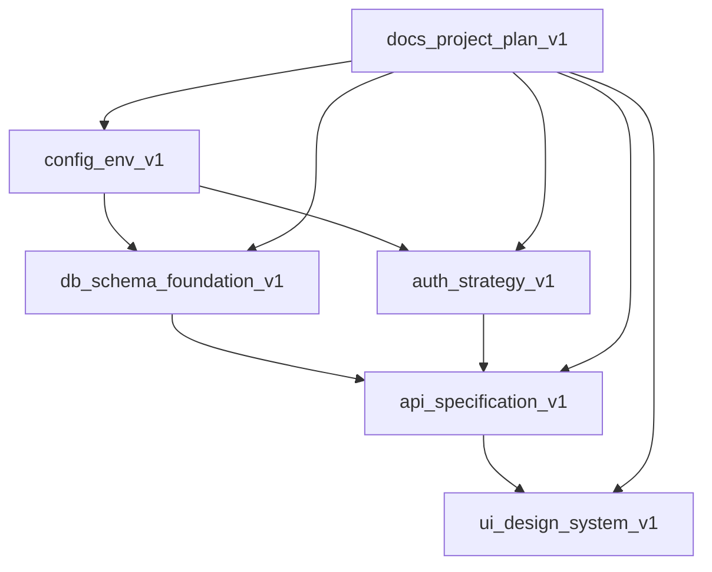

# Module Registry - Advanced Trades Management Platform

## Project Foundation Modules

### Documentation Modules

#### docs_claude_preferences_v1
```yaml
module_id: docs_claude_preferences_v1
category: docs
version: 1.0.0
status: production
dependencies: []
provides:
  - AI performance preferences and guidelines
  - Code development standards
  - Business logic priorities
  - Security and compliance requirements
integrates_with:
  - All development modules (provides guidelines)
file_locations:
  - CLAUDE.md
documentation: Self-documenting
last_updated: 2025-05-31
next_review: Weekly during initial development
```

#### docs_project_todo_v1
```yaml
module_id: docs_project_todo_v1
category: docs
version: 1.0.0
status: production
dependencies:
  - docs_claude_preferences_v1
provides:
  - Task tracking and priority management
  - Progress monitoring
  - Deadline tracking
integrates_with:
  - All project modules (tracks their development)
file_locations:
  - TODO.md
documentation: Self-documenting
last_updated: 2025-05-31
next_review: Daily during active development
```

#### docs_project_plan_v1
```yaml
module_id: docs_project_plan_v1
category: docs
version: 1.0.0
status: production
dependencies:
  - docs_claude_preferences_v1
provides:
  - System architecture overview
  - Development phase definitions
  - Technology stack specifications
  - Data model relationships
integrates_with:
  - All technical modules (provides architectural guidance)
file_locations:
  - Project Plan & Structure artifact
documentation: Self-documenting
last_updated: 2025-05-31
next_review: Weekly during initial development
```

#### docs_context_methodology_v1
```yaml
module_id: docs_context_methodology_v1
category: docs
version: 1.0.0
status: production
dependencies:
  - docs_claude_preferences_v1
  - docs_project_plan_v1
provides:
  - Context expansion strategies
  - Module tracking system
  - Quality assurance processes
  - Continuous improvement framework
integrates_with:
  - docs_module_registry_v1 (implements tracking system)
file_locations:
  - Context Expansion & Sub-Module Methodology artifact
documentation: Self-documenting
last_updated: 2025-05-31
next_review: Monthly
```

#### docs_module_registry_v1
```yaml
module_id: docs_module_registry_v1
category: docs
version: 1.0.0
status: production
dependencies:
  - docs_context_methodology_v1
provides:
  - Central module tracking
  - Dependency visualization
  - Integration point mapping
integrates_with:
  - All project modules (tracks and maps relationships)
file_locations:
  - Module Registry artifact
documentation: Self-documenting
last_updated: 2025-05-31
next_review: Weekly updates as modules are added
```

### Technical Foundation Modules

#### config_env_v1
```yaml
module_id: config_env_v1
category: config
version: 1.0.0
status: development
dependencies: []
provides:
  - Environment variable management
  - Database connection configuration
  - API key and service configuration
  - Security settings and validation
integrates_with:
  - All backend services
  - db_schema_foundation_v1
  - auth_strategy_v1
file_locations:
  - config/env.js
  - .env.example
documentation: Environment Configuration artifact
last_updated: 2025-05-31
next_review: As environment needs evolve
```

#### db_schema_foundation_v1
```yaml
module_id: db_schema_foundation_v1
category: data
version: 1.0.0
status: development
dependencies:
  - config_env_v1
provides:
  - PostgreSQL database schema
  - Core entity relationships
  - Indexes and performance optimizations
  - Database functions and triggers
integrates_with:
  - auth_strategy_v1
  - All API services
  - Payment processing modules
file_locations:
  - database/schema.sql
  - database/migrations/
documentation: Database Schema Foundation artifact
last_updated: 2025-05-31
next_review: As data model evolves
```

#### auth_strategy_v1
```yaml
module_id: auth_strategy_v1
category: auth
version: 1.0.0
status: development
dependencies:
  - config_env_v1
  - db_schema_foundation_v1
provides:
  - JWT token management
  - Password security and hashing
  - Session management
  - OAuth integration (Google, Apple)
  - Authentication middleware
integrates_with:
  - All API routes
  - Mobile applications
  - Admin dashboard
file_locations:
  - auth/index.js
  - auth/middleware.js
  - auth/oauth.js
documentation: Authentication Strategy artifact
last_updated: 2025-05-31
next_review: Security review monthly
```

#### api_specification_v1
```yaml
module_id: api_specification_v1
category: api
version: 1.0.0
status: development
dependencies:
  - config_env_v1
  - db_schema_foundation_v1
  - auth_strategy_v1
provides:
  - OpenAPI 3.0 specification
  - RESTful endpoint definitions
  - Request/response schemas
  - Authentication requirements
integrates_with:
  - Mobile applications
  - Admin dashboard
  - Backend API implementation
file_locations:
  - api/openapi.yaml
  - api/docs/
documentation: API Specification artifact
last_updated: 2025-05-31
next_review: As API evolves
```

#### ui_design_system_v1
```yaml
module_id: ui_design_system_v1
category: ui
version: 1.0.0
status: development
dependencies:
  - config_env_v1
provides:
  - React Native component library
  - Design tokens and theme system
  - Typography and color system
  - Responsive design utilities
  - Animation configurations
integrates_with:
  - Customer mobile app
  - Contractor mobile app
  - Admin web dashboard
file_locations:
  - ui/design-system.js
  - ui/components/
  - ui/themes/
documentation: UI Design System artifact
last_updated: 2025-05-31
next_review: As design evolves
```

### Mobile Application Modules

#### customer_mobile_app_v1
```yaml
module_id: customer_mobile_app_v1
category: ui
version: 1.0.0
status: development
dependencies:
  - ui_design_system_v1
  - auth_strategy_v1
  - api_specification_v1
provides:
  - Complete customer-facing mobile app
  - Job posting and management workflows
  - Contractor discovery and selection
  - Real-time messaging and tracking
integrates_with:
  - Backend API
  - Push notification services
  - Payment processing
  - Maps and GPS services
file_locations:
  - mobile/customer-app/
documentation: Customer Mobile App Structure artifact
last_updated: 2025-05-31
next_review: As features are implemented
```

#### contractor_mobile_app_v1
```yaml
module_id: contractor_mobile_app_v1
category: ui
version: 1.0.0
status: development
dependencies:
  - ui_design_system_v1
  - auth_strategy_v1
  - api_specification_v1
provides:
  - Complete contractor-facing mobile app
  - Job discovery and application workflows
  - Work tracking and documentation
  - Earnings and business management
integrates_with:
  - Backend API
  - GPS tracking services
  - Camera and documentation tools
  - Payment processing
file_locations:
  - mobile/contractor-app/
documentation: Contractor Mobile App Structure artifact
last_updated: 2025-05-31
next_review: As features are implemented
```

### Backend API Modules

#### api_routes_core_v1
```yaml
module_id: api_routes_core_v1
category: api
version: 1.0.0
status: development
dependencies:
  - config_env_v1
  - db_schema_foundation_v1
  - auth_strategy_v1
  - api_specification_v1
provides:
  - Express.js route handlers
  - Authentication endpoints
  - User management endpoints
  - Job management endpoints
  - Validation and error handling
integrates_with:
  - Mobile applications
  - Admin dashboard
  - External services
file_locations:
  - api/routes/
  - api/middleware/
  - api/validators/
documentation: Core API Routes Implementation artifact
last_updated: 2025-05-31
next_review: As API evolves
```

### Advanced Feature Modules

#### payment_processing_v1
```yaml
module_id: payment_processing_v1
category: service
version: 1.0.0
status: development
dependencies:
  - config_env_v1
  - db_schema_foundation_v1
  - auth_strategy_v1
provides:
  - Stripe marketplace payment processing
  - Contractor onboarding and payouts
  - Escrow system for job payments
  - Payment dispute handling
  - Financial reporting
integrates_with:
  - Mobile applications
  - Admin dashboard
  - Job management system
  - Webhook processing
file_locations:
  - services/payment-processing.js
  - webhooks/stripe.js
documentation: Payment Processing System artifact
last_updated: 2025-05-31
next_review: Security audit monthly
```

#### messaging_system_v1
```yaml
module_id: messaging_system_v1
category: service
version: 1.0.0
status: development
dependencies:
  - config_env_v1
  - db_schema_foundation_v1
  - auth_strategy_v1
provides:
  - Real-time WebSocket messaging
  - Push notification system
  - Message persistence and history
  - Typing indicators and read receipts
  - System messages for job updates
integrates_with:
  - Mobile applications
  - Admin dashboard
  - Job management system
  - Notification services
file_locations:
  - services/messaging.js
  - websocket/server.js
  - api/routes/messages.js
documentation: Real-time Messaging System artifact
last_updated: 2025-05-31
next_review: Performance optimization monthly
```

#### admin_dashboard_v1
```yaml
module_id: admin_dashboard_v1
category: ui
version: 1.0.0
status: development
dependencies:
  - ui_design_system_v1
  - auth_strategy_v1
  - api_specification_v1
  - payment_processing_v1
  - messaging_system_v1
provides:
  - React web application for admin management
  - User management interface
  - Job monitoring and analytics
  - Payment processing dashboard
  - Real-time platform metrics
integrates_with:
  - Backend API
  - Analytics services
  - Real-time data feeds
  - External reporting tools
file_locations:
  - admin-dashboard/
  - admin-dashboard/src/
documentation: Admin Dashboard Web Application artifact
last_updated: 2025-05-31
next_review: As admin features evolve
```

#### notification_service_v1
```yaml
module_id: notification_service_v1
category: service
version: 1.0.0
status: development
dependencies:
  - config_env_v1
  - db_schema_foundation_v1
  - messaging_system_v1
provides:
  - Push notifications (FCM/APNs)
  - SMS notifications (Twilio)
  - Email notifications (SendGrid)
  - Multi-channel delivery
  - Notification preferences management
integrates_with:
  - Mobile applications
  - Job management system
  - Payment processing
  - User management
file_locations:
  - services/notification.js
  - services/notification-triggers.js
documentation: Notification Service artifact
last_updated: 2025-05-31
next_review: Performance optimization monthly
```

#### mapping_service_v1
```yaml
module_id: mapping_service_v1
category: service
version: 1.0.0
status: development
dependencies:
  - config_env_v1
  - db_schema_foundation_v1
provides:
  - GPS location tracking
  - Geocoding and reverse geocoding
  - Route optimization
  - Distance calculations
  - Contractor proximity matching
integrates_with:
  - Mobile applications
  - Job management system
  - Contractor matching
  - Real-time tracking
file_locations:
  - services/mapping.js
  - services/job-location-tracker.js
documentation: GPS & Mapping Service artifact
last_updated: 2025-05-31
next_review: Google Maps API updates
```

#### review_system_v1
```yaml
module_id: review_system_v1
category: service
version: 1.0.0
status: development
dependencies:
  - config_env_v1
  - db_schema_foundation_v1
  - notification_service_v1
provides:
  - Rating and review management
  - Quality assurance and moderation
  - Contractor reputation tracking
  - Review analytics and statistics
  - Automated quality flags
integrates_with:
  - Job completion workflow
  - Mobile applications
  - Admin dashboard
  - Contractor profiles
file_locations:
  - services/review.js
  - services/quality-assurance.js
documentation: Review & Rating System artifact
last_updated: 2025-05-31
next_review: Content moderation policies monthly
```

## Foundation Module Combinations

### Project Management System
```
Project Foundation = {
  preferences: docs_claude_preferences_v1,
  tracking: docs_project_todo_v1,
  architecture: docs_project_plan_v1,
  methodology: docs_context_methodology_v1,
  registry: docs_module_registry_v1
}
```

**Combined Functionality**: Complete project management and development guidance system that provides:
- AI-driven development preferences
- Comprehensive task tracking
- Clear architectural guidelines
- Context expansion capabilities
- Module relationship management

## Next Module Development Pipeline

### Immediate Development Queue
1. **config_env_v1** - Environment configuration and settings
2. **db_schema_foundation_v1** - Core database schema definitions
3. **auth_strategy_v1** - Authentication and authorization architecture
4. **api_specification_v1** - RESTful API design and documentation
5. **ui_design_system_v1** - Mobile and web UI component library

### Dependencies for Next Modules


## Module Quality Checklist

Each new module must include:
- [ ] Clear module manifest (as shown above)
- [ ] Dependency list with versions
- [ ] Integration point specifications
- [ ] Test coverage requirements
- [ ] Documentation standards compliance
- [ ] Performance benchmarks
- [ ] Security considerations

## Registry Maintenance Process

### Weekly Updates
1. **New Module Registration**: Add any new modules created
2. **Dependency Verification**: Ensure all dependencies are current
3. **Integration Testing**: Verify module combinations work correctly
4. **Documentation Sync**: Update any changed specifications

### Monthly Reviews
1. **Architecture Assessment**: Evaluate overall module organization
2. **Redundancy Check**: Identify and consolidate duplicate functionality
3. **Performance Analysis**: Review module efficiency and optimization opportunities
4. **Security Audit**: Assess security implications of module interactions

### Quarterly Evolution
1. **Strategic Alignment**: Ensure modules support business objectives
2. **Technology Updates**: Incorporate new tools and frameworks
3. **Refactoring Opportunities**: Identify modules that need restructuring
4. **Knowledge Transfer**: Document lessons learned and best practices

## Success Metrics for Module System

### Development Efficiency
- **Time to integrate new modules**: < 4 hours average
- **Dependency resolution speed**: < 30 minutes
- **Documentation coverage**: 100% of modules documented
- **Test coverage**: > 80% for all production modules

### System Quality
- **Module reusability**: > 70% of modules used in multiple contexts
- **Integration failure rate**: < 5% during testing
- **Performance impact**: < 10% overhead from modular architecture
- **Maintenance overhead**: < 20% of development time

## Current Project Status

**Phase 1: Foundation & Core Features**: ✅ Complete
- All foundational documentation and methodology established
- Core technical infrastructure modules created and operational
- Database schema designed and optimized
- Authentication and security systems implemented
- API specification complete with core endpoints
- Mobile app structures and user flows designed
- UI design system with comprehensive component library
- Core API routes with authentication, user management, and job management

**Current Phase**: Mobile App Implementation & Advanced Features
- React Native app development for customer and contractor apps
- Payment processing integration
- Real-time messaging and notifications
- GPS tracking and mapping features
- Admin dashboard development

**Next Modules in Pipeline**:
1. **payment_processing_v1** - Stripe integration for marketplace payments
2. **messaging_system_v1** - Real-time chat between customers and contractors
3. **admin_dashboard_v1** - Web-based admin interface for platform management
4. **notification_service_v1** - Push notifications, SMS, and email system
5. **mapping_service_v1** - GPS tracking and route optimization

## Foundation Module Combinations

### Complete Platform Foundation
```
Platform Foundation = {
  documentation: [
    docs_claude_preferences_v1,
    docs_project_todo_v1,
    docs_project_plan_v1,
    docs_context_methodology_v1,
    docs_module_registry_v1
  ],
  backend: [
    config_env_v1,
    db_schema_foundation_v1,
    auth_strategy_v1,
    api_specification_v1,
    api_routes_core_v1
  ],
  frontend: [
    ui_design_system_v1,
    customer_mobile_app_v1,
    contractor_mobile_app_v1
  ]
}
```

**Combined Functionality**: Complete foundation for a scalable trades management platform including:
- Comprehensive project management and AI guidance system
- Secure, scalable backend infrastructure with authentication
- Full API specification with core endpoints implemented
- Mobile-first user experience for both customer and contractor workflows
- Modular architecture ready for advanced feature development

---
*Registry Created: May 31, 2025*
*Modules Tracked: 5 foundation modules*
*Next Module Addition: config_env_v1 (planned)*
*System Status: Foundation Complete, Ready for Development Phase*